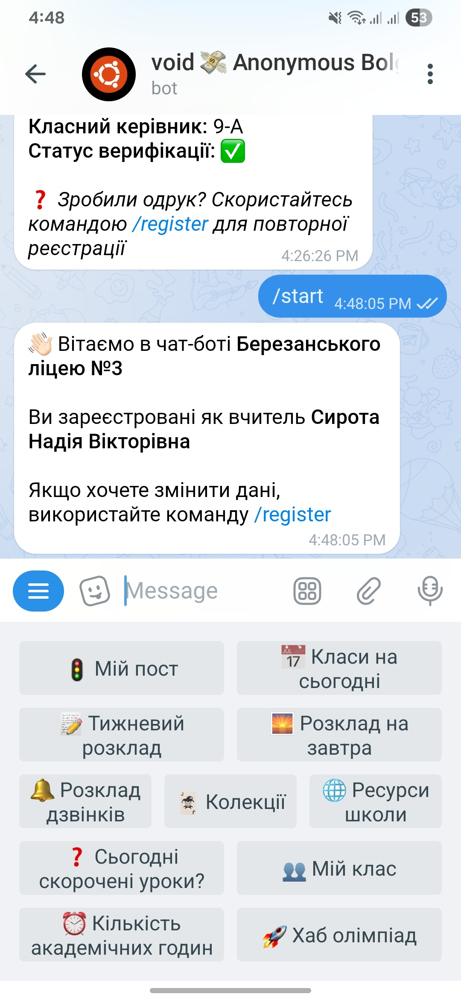
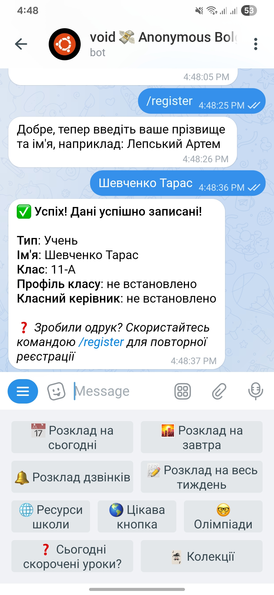

<div align="center">

# 📚 Телеграм бот для школи

[](https://python.org/)
[](https://aiogram.dev/)

[](https://wakatime.com/badge/user/5f28d705-3bc8-4138-8151-e12e0f9e9a23/project/8de912d0-8756-4287-b569-1f74298c8169)
[](https://github.com/noinsts/lyceum-3/commits/)

**Lyceum-3** — це бот створений для учнів та вчителів **Березанського ліцею №3**.


</div>

## 📎 Зміст
- [Функції бота](#-функції-бота)
- [Колекційні картки](#-колекційні-картки)
- [Технологічний стек](#-технологічний-стек)
- [Документація](#-проектна-документація)
- [Як запустити](#-як-запустити)
- [Архітектура проєкту](#-архітектура-проєкту)
- [Docker](#-docker-незабаром)
- [Ліцензія](#-ліцензія)
- [Автор](#-автор)

## 🧩 Функції бота

Lyceum-3 `поки` представляє невеликий спектр різноманітних функцій задля збільшення продуктивності та комфорту здобувачів освіти та викладачів.

### 👨‍🎓 Для учнів

| Фукнція                    | Опис                                              |
|----------------------------|---------------------------------------------------|
| 📅 **Розклад на сьогодні** | Отримуйте уроки на поточний день                  |
| 🌇 **Розклад на завтра**   | Персональний розклад вашого класу на завтра       |
| 📝 **Розклад на тиждень**  | Повний тижневий розклад                           |
| 🚀 **Мої олімпіади**       | Список олімпіад на які записаний користувач       |
| 🎴 **Колекційні картки**   | Тижневий дроп унікальних карток з різною рідкістю |

### 👨‍🏫 Для вчителів:

| Функція                           | Опис                                     |
|-----------------------------------|------------------------------------------|
| ⏰ **Кількість академічних годин** | Підрахунок та аналіз навантаження        |
| 📅 **Мої класи на сьогодні**      | Розклад уроків користувача               |
| 🌅 **Розклад на завтра**          | Відображає розклад користувача на завтра |
| 🚦 **Мій пост**                   | Інформація про чергування                |
| 👥 **Управління класом**          | Оголошення та інформація про клас        |

### 👑 Адміністратор

| Функція                     | Опис                                        |
|-----------------------------|---------------------------------------------|
| 📢 **Брокер система**       | Масові розсилки оголошень                   |
| 🗓️ **Зміни в розкладі**    | Сповіщення про оновлення розкладу           |
| 💾 **Redis Control Panel**  | Управління кешем та сесіями                 |
| 🗂️ **Управління класами**  | Редагування предметів та класних керівників |
| ⏰ **Скорочені дні**         | Налаштування скорочених уроків              |

### 🧑‍💻 Панель розробника
| Фукнція                  | Опис                               |
|--------------------------|------------------------------------|
| 🔑 **Access Control**    | Верифікація та блокування вчителів |
| 📊 **Server Stats**      | Моніторинг здоров'я сервера        |
| 📢 **Broker Management** | Управління розсилками              |
| 🎴 **Collections Panel** | CRUD операції для карток           |

### 🫂 Для всіх

| Функція                        | Опис                                     |
|--------------------------------|------------------------------------------|
| 🔔 **Розклад дзвінків**        | Синхронізований розкла дзвінків          |
| ❓ **Сьогодні скорочені уроки** | Інформація про скороченість робочого дня |
| 🌐 **Ресурси школи**           | Всі інтернет-джерела школи               |

## 📱 Приклад використання

| Вчитель                              | Учень                                |
|--------------------------------------|--------------------------------------|
|  |  |


<p align="center">
    <i>Короткий погляд на інтерфейси користувачів у Telegram 💬</i>
</p>

## 🎴 Колекційні картки

Раз на тиждень ви можете відкрити **нову картку**, яка потрапить у ваш інвентар.

### 📊 Розподіл рідкості

```
💚 Звичайна (50%)        ████████████████████
🩶 Рідкісна (25%)        ██████████
💜 Надзвичайно (15%)     ██████
🩵 Епічна (7%)           ███
💛 Легендарна (3%)       █
```

Деякі з них входять до **тематичних колекцій**, які можна зібрати повністю 🎯

### 📦 Приклад карток:


## 🧰 Технологічний стек

| Компонент                     | Технологія               | Версія  |
|-------------------------------|--------------------------|---------|
| Мова                          | Python                   | 3.12+   |
| Бот Telegram                  | aiogram                  | 3.20.0  |
| Робота з .env                 | python-dotenv            | 1.1.0   |
| Робота з часом                | pytz                     | 2025.2  |
| Google Sheets API             | gspread                  | 6.2.1   |
| Авторизація Google API        | oath2client              | 4.1.3   |
| Google API                    | google-api-python-client | 2.170.0 |
| Google Auth                   | google-auth              | 2.40.2  |
| Google OAuth                  | google-auth-oathlib      | 1.2.2   |
| ORM для бази даних            | sqlalchemy               | 2.0.42  |
| PostgreSQL драйвер            | psycopg2-binary          | 2.9.10  |
| Асинхроний PostgreSQL драйвер | asyncpg                  | 0.30.0  |
| Схема                         | pydantic                 | 2.11.5  |
| Логи                          | loguru                   | 0.7.3   |
| Кешування                     | redis                    | 6.4.0   |
| Моніторинг процесів           | psutil                   | 7.0.0   |

## ✍️ Проектна документація
- **[База даних](docs/database.md)** — опис моделей БД
- **[Middlewares](src/middlewares/README.md)** — опис усіх middleware'ів проєкту
- **[Панель адміністратора](docs/admin.md)** — як правильно користуватись адмін панеллю

## 🚀 У розробці
Цей бот активно розвивається. Якщо у вас є пропозиції — ласкаво просимо до issue 😉

## 🧠 Як запустити?

### Передумови

- Python 3.12+ 
- PostgreSQL
- Redis
- Git

### Крок 1: Клонування

```bash
git clone https://github.com/noinsts/lyceum-3.git
cd lyceum-3
```

### Крок 2: Змінні середовища

```bash
cp .env.example .env
```

Заповніть `.env` файл:

```env
TOKEN = ""

SHEET_ID = "-4l8"

NGROK = ""

POSTGRESQL_URL = ""

REDIS_URL = ""
```

### Крок 3: Google API

1. Перейдіть в [Google Console Cloud](https://console.cloud.google.com/)
2. Створіть проєкт та включіть Google Sheets API.
3. Завантажте `credentials.json`
4. Збережіть у директорію `creds/`:

    ```bash
   mkdir creds
   mv ~/Downloads/credentials.json creds/
    ```

### Крок 4: Залежності

```bash
poetry install
```

### Крок 5: База даних

```bash
poetry run alembic upgrade head
```

### Крок 6: Запуск

```bash
python3 run.py
```

Готово! 🎉 Бот запущено на `localhost`.

## 🔧 Налагодження

### Проблема: "Connection refused" PostgreSQL

```bash
# Перевірте, чи запущена БД
sudo systemctl status postgresql

# Запустіть, якщо вимкнена
sudo systemctl start postgresql
```

### Проблема: Redis помилка

```bash
# Перевіряємо, чи запущений Redis
sudo systemctl status redis-server

# Запуск, якщо вимкнена
sudo systemctl start redis-server
```

## 🛠️ Архітектура проєкту

```
lyceum-3/
├── assets/             # Ресурси проєкту
├── creds/              # Ключ для Google API
├── docs/               # Проєктна документація
├── logs/               # Логи бота
├── scripts/            # Скрипти для Google Sheet
├── settings/           # Налаштування: список адміністраторів та розробник etc...
├── src/                # Основна логіка бота
│   ├── db/             # Робота з базою даних
│   ├── decorators/     # Кастомні декоратори
│   ├── enums/          # Енуми
│   ├── exceptions/     # Кастомні помилки
│   ├── filters/        # Фільтри callback
│   ├── handlers/       # Обробники команд, повідомлень, callback
│   ├── keyboards/      # Клавіатури та інлайн-кнопки
│   ├── middlewares/    # Middleware для апдейтів
│   ├── parsers/        # Парсери даних
│   ├── service/        # Бізнес-логіка
│   ├── sheets/         # API розкладу уроків
│   ├── states/         # Стани користувачів (FSM)
│   ├── utils/          # Допоміжні функції
│   ├── validators/     # Валідація даних
│   ├── __init__.py
│   ├── bot_instance.py # Створення інстансу бота
│   └── main.py         # Логіка створення бота
├── .env                # Секретики
├── .env.example        # Приклад .env
├── .gitignore          # Список ігнор директорій, файлів для Git
├── LICENSE             # Ліцензія
├── poetry.lock         # Файл Poetry
├── pyproject.toml      # Список залежностей
├── README.md           # Документація
├── run.bash            # Bash-скрипт для запуску
└── run.py              # Точка входу в Python
```

## 🐳 Docker
Планується підтримка контейнеризації для швидкого розгортання.

## 🛡 Ліцензія
Цей проєкт ліцензовано під [MIT License](./LICENSE).

## ✨ Автор

<table>
  <tr>
    <td align="center">
      <a href="https://github.com/noinsts">
        
        <br />
        <sub><b>noinsts</b></sub>
      </a>
    </td>
  </tr>
</table>


---

<p align="center">
    Зроблено з ❤️ для учнів та вчителів Березанського ліцею №3
</p>
